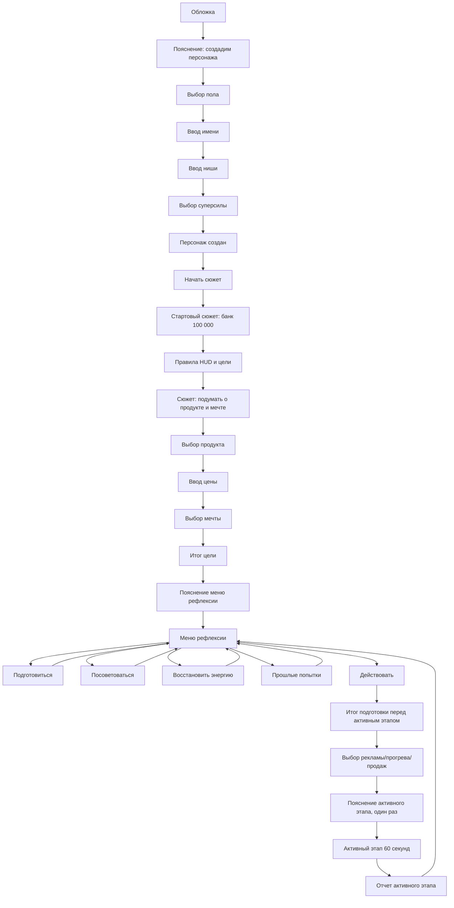
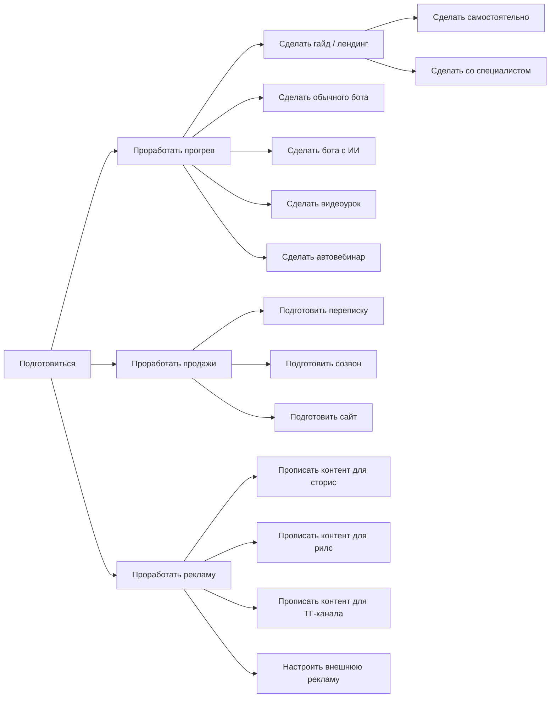

# ТЗ v3: игровой путь по Miro

## Статус документа

Этот документ является главным источником правды по логике экранов, переходам, кнопкам, расположению элементов и новой механике игрового цикла.

Основа документа:

- Miro-схема Никиты от 14 июля 2026;
- скопированный текст с Miro-доски;
- уточнения из переписки с Никитой после просмотра скриншотов.

Если этот документ конфликтует со старыми заметками, скриншотами или сгенерированными артефактами, использовать этот документ.
Важные исправления, ошибки интерпретации и решения после реализации фиксируются в `docs/lessons_learned.md`.
Старые v1/v2 ТЗ удалены из активного контекста проекта и не должны использоваться как требования.

## Обязательные архитектурные правила

- Интерфейс остается последовательной визуальной игрой, а не dashboard.
- Не возвращать клиентскую очередь будущих экранов как источник правды.
- Каноническое состояние игры хранится на сервере.
- Клиент показывает один текущий экран, вычисленный из состояния.
- Все расчеты ресурсов, дней, денег, энергии, лидов, продаж и результатов активного этапа должны жить в `packages/game-engine`.
- UI не должен хардкодить баланс, цены, конверсии, расходы энергии или длительности.
- Все state-changing команды должны быть идемпотентными.
- Все игровые случайности должны быть deterministic seeded random, без `Math.random()`.

## Легенда Miro

В Miro используются цветовые обозначения. При реализации это не обязательно должны быть те же цвета, но смысл элементов сохранить.

```text
+-----------------------------+
| Желтый блок                  | Картинка / gif / визуальная зона
+-----------------------------+
| Красный блок                 | Кнопка для нажатия
+-----------------------------+
| Зеленый блок                 | Поле ввода
+-----------------------------+
| Серый блок                   | Текстовое / информационное поле
+-----------------------------+
| Оранжевая полоса             | Таймер активного этапа
+-----------------------------+
| Фиолетовый блок              | Активная зона: контент, входящие, тип события
+-----------------------------+
| Желтый блок внутри активки   | Успешное событие: залетевший контент, продажа
+-----------------------------+
```

Для успешных событий в активном этапе:

- если залетел контент или реклама, из блока один раз вылетают звездочки;
- если случилась продажа, из блока один раз вылетают зеленые значки доллара.

## Общая компоновка экранов

Проект mobile-first. Все экраны строятся как один вертикальный игровой экран.

### Базовый экран без HUD

Используется до старта игровой сессии и на части экранов создания персонажа.

```text
┌────────────────────────────────────┐
│ Заголовок / название этапа          │
├────────────────────────────────────┤
│                                    │
│ Желтая визуальная зона              │
│ картинка / gif / персонаж           │
│                                    │
├────────────────────────────────────┤
│                                    │
│ Серый текстовый блок                │
│ пояснение / реплика / результат     │
│                                    │
├────────────────────────────────────┤
│ Красная основная кнопка             │
└────────────────────────────────────┘
```

### Базовый игровой экран с HUD

Используется после начала сюжета.

```text
┌────────────┬────────────┬────────────┐
│ День {day} │ Банк {bank}│ Энергия {e}│
├────────────┴────────────┴────────────┤
│                                      │
│ Желтая визуальная зона / картинка    │
│                                      │
├──────────────────────────────────────┤
│ Серый блок заголовка / вопроса       │
├──────────────────────────────────────┤
│ Красные кнопки выбора                │
│ Красные кнопки выбора                │
│ Красные кнопки выбора                │
└──────────────────────────────────────┘
```

HUD всегда сверху и показывает:

- `🗓️ День {день}` - сколько игровых дней прошло;
- `🏦 Банк {банк}` - остаток стартового банка, выручка сюда не входит;
- `🔋 Энергия {энергия}` - текущий запас энергии.

## Главный поток экранов



Все экраны с правилами и объяснениями показываются один раз за игру. При повторном круге игрок сразу попадает к практическому экрану.

## Ресурсы и цели

### Стартовые ресурсы

- Банк: `100 000 ₽`.
- Энергия: `100`, кроме суперсилы `Энергичность`.
- С суперсилой `Энергичность`: стартовая энергия `120`.
- Длительность игры: `30 игровых дней`.

### Банк и выручка

Банк и выручка - разные сущности.

- Банк - деньги из стартовых `100 000 ₽`, которые можно тратить на специалистов и консультации.
- Выручка - деньги от продаж, нужны для цели и отчетов.
- Выручку нельзя тратить на подготовку.
- В HUD показывается банк, а не сумма банка и выручки.

### Условия завершения игры

Игра заканчивается, если:

- прошло 30 игровых дней;
- энергия закончилась;
- игрок сам завершил запуск;
- после активного этапа зафиксировано достижение цели.

Если цель достигнута внутри 60-секундного активного этапа, этап доигрывается до конца. После этого показывается победный итог с перевыполнением плана, если оно есть.

Если энергия закончилась внутри активного этапа, активный этап сразу обрывается, игра заканчивается выгоранием, необработанные лиды считаются потерянными.

### Цена продукта

Продукт выбирается из списка. Цена вводится вручную.

Технический минимум цены: `1000 ₽`. Если меньше, показывать ошибку: с таким чеком нет смысла запускать продажи.

Рекомендованные значения показывать как плейсхолдер в зависимости от продукта:

- консультации: `5000`;
- услуги: `15000`;
- уроки в записи: `3000`;
- живое обучение: `20000`;
- клуб / подписка: `1500`;
- сопровождение: `30000`.

Это рекомендации, не жесткие минимумы.

### Мечты

Мечта выбирается из списка плюс есть вариант свободного ввода.

Список адаптируется под пол персонажа, но количество вариантов сохраняется.

Женские варианты из Miro:

- новый айфон - `150 000 ₽`;
- поход в ЦУМ - `300 000 ₽`;
- отпуск - `300 000 ₽`;
- гардероб со стилистом - `200 000 ₽`;
- закрыть долги - `250 000 ₽`;
- накопить подушку - `400 000 ₽`;
- свой вариант.

Мужские варианты:

- PlayStation / техника;
- новый айфон / гаджет;
- отпуск;
- обновить гардероб;
- закрыть долги;
- накопить подушку;
- свой вариант.

План продаж считать по существующей старой логике, но обязательное правило: план должен быть больше или равен сумме выбранных мечт.

## Создание персонажа

### Экран 1. Обложка

Макет:

```text
┌────────────────────────────────────┐
│ Желтая картинка                    │
│ Мужской и женский персонаж          │
│ стоят на пляже на закате            │
│ море, закат                         │
├────────────────────────────────────┤
│ Серая карточка:                    │
│ Первая игра в продажи              │
│ своего онлайн продукта              │
│                                    │
│ Проживите 30 дней запуска           │
│ за 10 минут                         │
│                                    │
│ Принимайте решения.                 │
│ Смотрите на последствия.            │
│                                    │
│ Посмотрим, сколько вы сможете       │
│ заработать на своем продукте        │
│ и какую мечту реализуете            │
├────────────────────────────────────┤
│ [Начать игру]                       │
│ [Продолжить сохраненную игру]*      │
└────────────────────────────────────┘
```

`Продолжить сохраненную игру` показывать только при валидной сохраненной сессии.

### Экран 2. Переход к созданию персонажа

```text
┌────────────────────────────────────┐
│                                    │
│ Серая карточка по центру:           │
│ Сначала создадим игрового           │
│ персонажа, после приступим          │
│ к сюжету                            │
│                                    │
└────────────────────────────────────┘
```

Кнопки на скрине Miro нет, но в приложении нужен переход дальше. Использовать красную кнопку `Далее`.

### Экран 3. Выбор пола

```text
┌────────────────────────────────────┐
│ Создание персонажа                  │
├────────────────────────────────────┤
│ Выберите пол вашего персонажа       │
├──────────────────┬─────────────────┤
│ Желтая карточка   │ Желтая карточка │
│ мужской аватар    │ женский аватар  │
├──────────────────┼─────────────────┤
│ [Мужчина]         │ [Женщина]       │
└──────────────────┴─────────────────┘
```

Пол влияет на аватар, обращения и список мечт. На механику не влияет.

### Экран 4. Имя

```text
┌────────────────────────────────────┐
│ Создание персонажа                  │
├──────────────┬─────────────────────┤
│ Аватар       │ Таблица данных       │
│ персонажа    │ Имя {имя}            │
│              │ Пол {пол}            │
│              │ Ниша {ниша}          │
│              │ Сила {сила}          │
├────────────────────────────────────┤
│ Введите имя персонажа               │
├────────────────────────────────────┤
│ Зеленое поле: Например: Галина      │
├────────────────────────────────────┤
│ [Готово, дальше]                    │
└────────────────────────────────────┘
```

Имя: 2-30 символов. Пользовательский ввод считать данными, не HTML.

### Экран 5. Ниша

Такой же макет, как экран имени. Поле:

```text
Введите какая ниша или чем занимается {имя}
Зеленое поле: Например: Психолог
```

Ниша - свободный ввод.

### Экран 6. Суперсила

```text
┌────────────────────────────────────┐
│ Создание персонажа                  │
├──────────────┬─────────────────────┤
│ Аватар       │ Таблица данных       │
├────────────────────────────────────┤
│ Выберите одну суперсилу на игру     │
├────────────────────┬───────────────┤
│ Чаще доводит       │ [Продажи]      │
│ заявки до оплаты   │               │
├────────────────────┼───────────────┤
│ Сильнее прогревает │ [Маркетинг]    │
│ людей перед покупкой│              │
├────────────────────┼───────────────┤
│ Больше энергии     │ [Энергичность] │
│ на старте игры     │               │
├────────────────────┼───────────────┤
│ Больше внимания    │ [Реклама]      │
│ из рекламы         │               │
├────────────────────────────────────┤
│ [Готово, дальше]                    │
└────────────────────────────────────┘
```

Суперсила выбирается одна.

### Экран 7. Персонаж создан

```text
┌────────────────────────────────────┐
│ Создание персонажа                  │
├──────────────┬─────────────────────┤
│ Аватар       │ Таблица данных       │
├────────────────────────────────────┤
│ Поздравляем! Персонаж создан!       │
├────────────────────────────────────┤
│ Серый блок:                         │
│ Вы выбрали суперсилу "..."!         │
│                                    │
│ Короткое объяснение эффекта.        │
├────────────────────────────────────┤
│ [Начать сюжет!]                     │
└────────────────────────────────────┘
```

Для `Маркетинг` текст из Miro:

```text
Вы выбрали суперсилу "Маркетинг"!

Она повышает конверсию прогрева и показывает результативность инструментов прогрева.
```

Для остальных суперсил нужны аналогичные тексты.

## Суперсилы

У каждой суперсилы два эффекта:

1. небольшой числовой бонус в своей зоне;
2. информационный эффект или особое преимущество.

### Маркетинг

- повышает конверсию прогрева;
- показывает примерную конверсию инструментов прогрева;
- конверсию показывать диапазоном, например `15-25%`;
- показывать и при подготовке, и при выборе прогрева перед активным этапом.

Если игрок с `Маркетингом` делает инструмент прогрева самостоятельно, качество самостоятельного варианта почти догоняет специалиста. Специалист все еще может быть немного лучше.

### Реклама

- повышает конверсию / эффективность рекламы;
- показывает примерные просмотры, стоимость и конверсионность рекламных инструментов;
- риск показывать только если он полезен как предупреждение, например высокий чек плохо сочетается с конкретной рекламой.

### Продажи

- повышает конверсию в продажу;
- показывает примерные конверсии инструментов продаж;
- может показывать предупреждения по чеку, например высокий чек хуже продавать только перепиской.

### Энергичность

- стартовая энергия `120`;
- расход энергии и восстановление такие же, как у остальных.

## Сюжет и выбор цели

### Экран: стартовый сюжет с банком

```text
┌────────────┬────────────┬────────────┐
│ День {day} │ Банк {bank}│ Энергия {e}│
├──────────────────────────────────────┤
│ Желтая картинка: персонаж сидит      │
│ на берегу моря со спутником,          │
│ ракурс со спины                       │
├──────────────────────────────────────┤
│ Заголовок:                            │
│ Однажды к {Имя в дательном падеже}    │
│ на отдыхе подошел(ла) партнер(ша)...  │
├──────────────────────────────────────┤
│ Серый текст:                          │
│ Жирно: {Имя}, у нас сейчас все хорошо.│
│ Может в этом месяце выделим деньги    │
│ и время для твоих желаний и дела?     │
│                                      │
│ В этом месяце все вопросы с жильем,   │
│ едой и прочим решены.                 │
│                                      │
│ Что если выделить 100 000 рублей      │
│ на твое дело?                         │
│                                      │
│ Я думаю, что все получится!           │
├──────────────────────────────────────┤
│ [Далее]                               │
└──────────────────────────────────────┘
```

### Экран: правила HUD и цели

Показывается один раз.

```text
┌────────────┬────────────┬────────────┐
│ День       │ Банк       │ Энергия    │
├──────────────────────────────────────┤
│ Картинка: персонаж с указкой          │
│ показывает на желтую доску            │
│ "Правила игры".                       │
├──────────────────────────────────────┤
│ Серый блок правил:                    │
│ Правила игры                          │
│                                      │
│ Сверху экрана всегда показаны день,   │
│ банк и энергия.                       │
│                                      │
│ День - показывает сколько дней        │
│ из 30 прошло. Расходуется по мере     │
│ работы.                               │
│                                      │
│ Банк - это остаток стартовых          │
│ 100 000 рублей. Выручка от продаж     │
│ в эту сумму не входит. Расходуется    │
│ при покупках.                         │
│                                      │
│ Энергия - на сколько вы полны сил     │
│ для работы. Расходуется почти         │
│ при любых действиях.                  │
│                                      │
│ Игра считается выиграна, когда        │
│ вы купите свою мечту и закроете       │
│ план по продажам.                     │
│                                      │
│ Игра проиграна, если закончилась      │
│ энергия, банк или дни, но не куплена  │
│ мечта и не выполнен план по продажам. │
│                                      │
│ Удачи!                                │
├──────────────────────────────────────┤
│ [Правила ясны!]                       │
└──────────────────────────────────────┘
```

### Экран: подумать о продукте и мечте

```text
┌────────────┬────────────┬────────────┐
│ День       │ Банк       │ Энергия    │
├──────────────────────────────────────┤
│ Картинка: крупный персонаж            │
│ и белое облако "Что же я хочу?"       │
├──────────────────────────────────────┤
│ Серый текст:                          │
│ Время придумать мечту!                │
│                                      │
│ Жена/муж пока поехал(а) по своим      │
│ делам. Я могу посвятить этот день     │
│ тому, чтобы придумать, что я хочу     │
│ и сколько для этого нужно сделать     │
│ продаж, чуть-чуть с запасом!          │
├──────────────────────────────────────┤
│ [Хорошо]                              │
└──────────────────────────────────────┘
```

### Экран: выбор продукта

```text
┌────────────┬────────────┬────────────┐
│ День       │ Банк       │ Энергия    │
├──────────────────────────────────────┤
│ Картинка: крупный персонаж            │
│ и белое облако "Что же я хочу?"       │
├──────────────────────────────────────┤
│ Выберите что будет продавать {имя}    │
├──────────────────┬───────────────────┤
│ [Консультации]   │ [Услуги]          │
│ [Живое обучение] │ [Уроки в записи]  │
│ [Клуб/подписка]  │ [Сопровождение]   │
├──────────────────────────────────────┤
│ [Готово, дальше]                     │
└──────────────────────────────────────┘
```

### Экран: ввод цены

```text
┌────────────┬────────────┬────────────┐
│ День       │ Банк       │ Энергия    │
├──────────────────────────────────────┤
│ Картинка: крупный персонаж            │
│ и калькулятор рядом.                  │
│ На экране калькулятора меняются цифры.│
├──────────────────────────────────────┤
│ В какую стоимость {имя} будет         │
│ продавать {продукт}?                  │
├──────────────────────────────────────┤
│ Зеленое поле: Например: 30000         │
├──────────────────────────────────────┤
│ [Готово, дальше]                     │
└──────────────────────────────────────┘
```

### Экран: выбор мечты

```text
┌────────────┬────────────┬────────────┐
│ День       │ Банк       │ Энергия    │
├──────────────────────────────────────┤
│ Картинка: персонаж на улице, рядом    │
│ 3 магазина: "Техника", "Одежда",      │
│ "Банк".                              │
├──────────────────────────────────────┤
│ Что {имя} хочет купить,               │
│ когда продажи пойдут?                 │
├──────────────────┬───────────────────┤
│ Серый вариант     │ Красная цена      │
│ Серый вариант     │ Красная цена      │
│ Серый вариант     │ Красная цена      │
│ Серый вариант     │ Красная цена      │
│ Серый вариант     │ Красная цена      │
│ Серый вариант     │ Красная цена      │
├──────────────────────────────────────┤
│ Свой вариант: название и стоимость    │
├──────────────────────────────────────┤
│ [Готово]                              │
└──────────────────────────────────────┘
```

Игрок может выбрать несколько готовых желаний и дополнительно указать один свой вариант. Переход на следующий экран происходит только после нажатия кнопки `Готово`.

### Экран: итог цели

```text
┌────────────┬────────────┬────────────┐
│ День       │ Банк       │ Энергия    │
├──────────────────────────────────────┤
│ Картинка: персонаж крупным планом,    │
│ диалоговое облако "Цель и мечта       │
│ готовы!"                              │
├──────────────────────────────────────┤
│ Цель запуска                          │
│ Прошел 1 день. {Имя} решил/решила,    │
│ что будет продавать {продукт} за      │
│ {цена}.                               │
│ В качестве желаний он/она             │
│ выбрал/выбрала {желания}.             │
│ Общая сумма желаний - {сумма}.        │
│ Для этого он/она поставил/поставила   │
│ цель с запасом: сделать {продаж}      │
│ продаж и                              │
│ заработать {выручка}.                 │
├──────────────────────────────────────┤
│ [Цель ясна]                           │
└──────────────────────────────────────┘
```

## Меню рефлексии

### Объяснение меню

Показывается один раз перед первым меню рефлексии.

```text
┌────────────┬────────────┬────────────┐
│ День       │ Банк       │ Энергия    │
├──────────────────────────────────────┤
│ Без картинки                          │
├──────────────────────────────────────┤
│ Вы готовы к старту запусков и продаж │
│                                      │
│ Сейчас вы попадете на экран           │
│ рефлексии. Это место, где вы решаете, │
│ что делать перед активной фазой       │
│ запуска.                              │
│                                      │
│ Пункт "Подготовиться" - там вы        │
│ выбираете, какие инструменты запуска  │
│ подготовить или купить.               │
│                                      │
│ Пункт "Посоветоваться" - там вы       │
│ можете получить рекомендации от       │
│ специалистов, когда не знаете, что    │
│ делать.                               │
│                                      │
│ Пункт "Отдохнуть" - выберите его,     │
│ когда вам нужно восстановить энергию. │
│ Имейте в виду, что каждый активный    │
│ этап тратит от 25% энергии.           │
│                                      │
│ Пункт "Прошлые попытки" - там вы      │
│ увидите результаты пройденных         │
│ активных этапов. Это поможет вам      │
│ сделать выводы и поменять стратегию.  │
│                                      │
│ Кнопка "Действовать" - для того,      │
│ чтобы начать активный этап запуска.   │
│ Нажимайте на нее, когда понимаете,    │
│ что у вас хватает энергии и готовы    │
│ все инструменты.                      │
│                                      │
│ Удачи!                                │
├──────────────────────────────────────┤
│ [Понятно!]                            │
└──────────────────────────────────────┘
```

### Само меню

```text
┌────────────┬────────────┬────────────┐
│ День       │ Банк       │ Энергия    │
├──────────────────────────────────────┤
│ Желтая картинка: мужчина и женщина    │
│ сидят за столом и пьют коктейли       │
│ на пляже                              │
├──────────────────────────────────────┤
│ Серый заголовок: Меню рефлексии       │
├──────────────────────────────────────┤
│ [Подготовиться]                       │
│ [Посоветоваться]                      │
│ [Восстановить энергию]                │
│ [Прошлые попытки]                     │
│ [Действовать]                         │
└──────────────────────────────────────┘
```

## Подготовка

### Основной принцип

Игрок может выбрать несколько действий подготовки перед активным этапом.

При выборе конкретной подготовки:

1. открывается подтверждение;
2. после подтверждения деньги и энергия списываются сразу;
3. отмены после подтверждения нет;
4. игровые дни не проходят сразу;
5. выбранная подготовка попадает в план текущего круга;
6. игрок возвращается в меню рефлексии;
7. при нажатии `Действовать` дни подготовки считаются и списываются.

Если игрок после подготовки выбирает отдых, подготовка остается в плане.

Отдельный экран "Запланированная подготовка" не нужен.

### Подтверждение подготовки

```text
┌────────────────────────────────────┐
│ Подтвердить действие?              │
├────────────────────────────────────┤
│ Серый текст:                       │
│ {Название подготовки}              │
│ Стоимость: {money}                 │
│ Энергия: {energy}                  │
│ Дней при старте активного этапа:    │
│ {duration}                         │
├──────────────────┬─────────────────┤
│ [Да, подтвердить]│ [Нет, отменить] │
└──────────────────┴─────────────────┘
```

После подтверждения коротко показать toast/маленькое сообщение:

```text
Работа учтена. Подготовка добавлена к текущему кругу.
```

### Расчет времени подготовки

Самостоятельные действия нельзя делать параллельно. Они складываются.

Покупные действия у специалиста идут параллельно:

- параллельно между собой;
- параллельно самостоятельной работе игрока.

Формула:

```text
дни подготовки =
max(
  сумма дней всех самостоятельных подготовок текущего круга,
  максимальная длительность среди всех подготовок у специалиста текущего круга
)
```

Пример:

```text
бот со специалистом: 3 дня
рилс самостоятельно: 4 дня

дни подготовки = max(4, 3) = 4
```

Пример:

```text
сайт со специалистом: 3 дня
рилс самостоятельно: 3 дня
бот с ИИ самостоятельно: 5 дней

дни подготовки = max(3 + 5, 3) = 8
```

Пример:

```text
сайт со специалистом: 3 дня
бот со специалистом: 3 дня
самостоятельных действий нет

дни подготовки = max(0, 3) = 3
```

### Блокировки

При подтверждении подготовки проверить, хватает ли денег и энергии.

Если не хватает:

- не подтверждать действие;
- показать понятное сообщение.

При нажатии `Действовать` проверить, хватает ли оставшихся игровых дней на подготовку и отдых текущего круга.

Если не хватает дней:

- показать сообщение: "Осталось меньше времени, чем требуется для этого действия";
- подготовка остается оплаченной и запланированной;
- активный этап не стартует.

## Дерево подготовки



Для каждого конечного пункта есть два варианта:

- `Сделать самостоятельно`;
- `Сделать со специалистом`.

### Подготовка прогрева

```text
Подготовиться
└─ Проработать прогрев
   ├─ Сделать гайд / лендинг
   │  ├─ Сделать самостоятельно
   │  └─ Сделать со специалистом
   ├─ Сделать обычного бота
   │  ├─ Сделать самостоятельно
   │  └─ Сделать со специалистом
   ├─ Сделать бота с ИИ
   │  ├─ Сделать самостоятельно
   │  └─ Сделать со специалистом
   ├─ Сделать видеоурок
   │  ├─ Сделать самостоятельно
   │  └─ Сделать со специалистом
   └─ Сделать автовебинар
      ├─ Сделать самостоятельно
      └─ Сделать со специалистом
```

`Автовебинар`, а не просто "вебинар", чтобы не создавать ожидание ручного проведения.

### Подготовка продаж

```text
Подготовиться
└─ Проработать продажи
   ├─ Подготовить переписку
   │  ├─ Сделать самостоятельно
   │  └─ Сделать со специалистом
   ├─ Подготовить созвон
   │  ├─ Сделать самостоятельно
   │  └─ Сделать со специалистом
   └─ Подготовить сайт
      ├─ Сделать самостоятельно
      └─ Сделать со специалистом
```

### Подготовка рекламы

```text
Подготовиться
└─ Проработать рекламу
   ├─ Прописать контент для сторис
   │  ├─ Сделать самостоятельно
   │  └─ Сделать со специалистом
   ├─ Прописать контент для рилс
   │  ├─ Сделать самостоятельно
   │  └─ Сделать со специалистом
   ├─ Прописать контент для ТГ-канала
   │  ├─ Сделать самостоятельно
   │  └─ Сделать со специалистом
   └─ Настроить внешнюю рекламу
      ├─ Сделать самостоятельно
      └─ Сделать со специалистом
```

### Повторяемость подготовки

Прогрев и продажи:

- готовятся один раз;
- остаются доступными навсегда;
- один и тот же вариант повторно подготовить нельзя;
- самостоятельный и специалистский вариант считаются разными инструментами.

Пример:

- `Гайд - самостоятельно`;
- `Гайд - со специалистом`.

Оба могут существовать одновременно и оба доступны при выборе прогрева.

Реклама:

- готовится на один активный этап;
- подготовленный рекламный вариант остается до использования;
- после использования в активном этапе считается потраченным;
- один и тот же рекламный вариант можно подготовить снова для следующих запусков.

Пример:

- игрок подготовил `Рилс - самостоятельно`;
- если в активном этапе выбрал не рилс, рилс остается на потом;
- если выбрал рилс, после активного этапа этот подготовленный рилс потрачен.

## Посоветоваться

### Дерево советов

```text
Посоветоваться
├─ Совет по рекламе
│  ├─ Совет знакомого спеца
│  ├─ Купить консультацию за 5к
│  └─ Купить консультацию за 10к
├─ Совет по прогреву
│  ├─ Совет знакомого спеца
│  ├─ Купить консультацию за 5к
│  └─ Купить консультацию за 10к
└─ Совет по продажам
   ├─ Совет знакомого спеца
   ├─ Купить консультацию за 5к
   └─ Купить консультацию за 10к
```

### Правила

- Любой совет или консультацию можно использовать один раз за один круг запуска.
- Бесплатный совет знакомого спеца - один раз за круг.
- Консультация за `5000 ₽` - один раз за круг.
- Консультация за `10000 ₽` - один раз за круг.
- Консультации списывают деньги сразу после подтверждения.
- Консультации не тратят игровые дни.
- Бесплатный совет денег не тратит.

### Качество советов

Бесплатный знакомый спец:

- дает общий совет;
- без точных цифр;
- пример: "лучше взять бота" или "лучше вести на созвоны".

Консультация за 5к:

- дает более точные цифры по выбранному направлению;
- пример: "этот рекламный инструмент даст примерно столько-то просмотров / конверсии".

Консультация за 10к:

- дает хорошие связки инструментов;
- пример: "лучше взять рекламу через рилс и прикрутить к ней бота с ИИ; ожидаемые конверсии такие-то".

## Восстановить энергию

```text
Восстановить энергию
├─ Отдохнуть 1 день (+20 ед энергии)
├─ Отдохнуть 2 дня (+45 ед энергии)
└─ Отдохнуть 3 дня (полное восстановление)
```

Отдых:

- тратит игровые дни;
- восстанавливает энергию;
- не сбрасывает запланированную подготовку;
- если отдых приводит к нехватке дней на уже оплаченную подготовку, при `Действовать` показать ошибку и не стартовать активный этап.

## Прошлые попытки

Кнопка показывает прошлые активные этапы.

Данные брать из отчетов, которые показываются после активного этапа.

Минимальный состав:

- номер активного этапа;
- сколько игровых дней занял;
- сколько энергии потрачено;
- какие инструменты использованы: реклама, прогрев, продажи;
- просмотры / входящие / лиды;
- сколько не проявили интерес;
- сколько проявили интерес;
- сколько требовали ответа;
- сколько остыли и ушли из-за долгого ответа;
- созвоны: проведено, купили, не купили;
- переписка: диалогов, купили, не купили;
- сайт: посетители, купили, написали;
- всего продаж;
- выручка активного этапа.

## Действовать

### Экран итогов подготовки перед активным этапом

Появляется после нажатия `Действовать`, если в текущем круге была подготовка или отдых.

```text
┌────────────┬────────────┬────────────┐
│ День       │ Банк       │ Энергия    │
├──────────────────────────────────────┤
│ Желтая картинка: ноутбук,             │
│ на котором бегает текст,              │
│ на фоне море и небо                   │
├──────────────────────────────────────┤
│ Серый текст:                          │
│ Во время подготовки вы решили сделать:│
│ - {подготовка 1}                      │
│ - {подготовка 2}                      │
│                                      │
│ Теперь вам доступны:                  │
│ - {новый инструмент 1}                │
│ - {новый инструмент 2}                │
│                                      │
│ Подготовка заняла {X} дней.           │
│ Отдых занял {Y} дней.                 │
│ Готовы начинать активные действия?    │
├──────────────────────────────────────┤
│ [Да, начать активный этап]            │
└──────────────────────────────────────┘
```

Если подготовки и отдыха нет, можно переходить сразу к выбору инструментов активного этапа.

### Выбор инструментов активного этапа

Перед стартом активного этапа игрок обязан выбрать:

- одну рекламу;
- один прогрев;
- один инструмент продаж.

Кнопка `Начать активный этап` активна только после выбора всех трех блоков.

```text
┌────────────┬────────────┬────────────┐
│ День       │ Банк       │ Энергия    │
├──────────────────────────────────────┤
│ Желтая картинка: персонажи на пляже   │
├──────────────────────────────────────┤
│ Серый заголовок:                      │
│ Решите, что {имя} будет делать        │
│ в этот раз                            │
├──────────────────────────────────────┤
│ [Выбрать рекламу 👇]                  │
│ Выбрано: {реклама или пусто}          │
├──────────────────────────────────────┤
│ [Выбрать прогрев 👇]                  │
│ Выбрано: {прогрев или пусто}          │
├──────────────────────────────────────┤
│ [Выбрать продажи 👇]                  │
│ Выбрано: {продажи или пусто}          │
├──────────────────────────────────────┤
│ [Начать активный этап]                │
└──────────────────────────────────────┘
```

### Списки выбора

Кнопки `Выбрать...` открывают список доступных вариантов.

Правила:

- подготовленные варианты доступны;
- неподготовленные варианты видны с замком и подписью `Не готово`;
- нельзя выбирать закрытый вариант;
- у вариантов, которые уже использовались, показывать известную конверсию / результат;
- у новых вариантов конверсию скрывать, кроме случаев суперспособности.

### Базовые варианты без подготовки

Всегда доступны:

- реклама: `Сделать без подготовки`;
- прогрев: `Греть руками в переписке`;
- продажи: `Продавать по наитию`.

Эти варианты:

- хуже подготовленных по конверсии;
- тратят больше энергии;
- дают более нестабильный результат.

## Активный этап

### Объяснение активного этапа

Показывается один раз перед первым активным этапом.

```text
┌────────────┬────────────┬────────────┐
│ День       │ Банк       │ Энергия    │
├──────────────────────────────────────┤
│ Без картинки                          │
├──────────────────────────────────────┤
│ Сейчас начнется активный этап         │
│                                      │
│ Он идет 60 секунд реального времени.  │
│                                      │
│ Вы увидите 3 этажа. Реклама, прогрев, │
│ продажи. На каждом из них             │
│ показываются показатели.              │
│                                      │
│ Ваша задача успевать делать целевые   │
│ действия, нажимая на кнопки на        │
│ этажах прогрева и продаж.             │
│                                      │
│ Когда вы нажимаете на кнопку - на     │
│ какое-то время нажать на другую       │
│ кнопку нельзя. Например пока вы       │
│ проводите созвон - вы не можете       │
│ отвечать на сообщения.                │
│                                      │
│ Ваша задача - сделать как можно       │
│ больше продаж. Результаты зависят от  │
│ ваших действий и от инструментов,     │
│ которые вы выбрали.                   │
│                                      │
│ После завершения активного этапа вы   │
│ увидите результаты, анализ и цифры    │
│ этапа. Это поможет вам сделать        │
│ выводы и скорректировать стратегию    │
│ при необходимости.                    │
│                                      │
│ Удачи!                                │
├──────────────────────────────────────┤
│ [Понятно!]                            │
└──────────────────────────────────────┘
```

### Длительность

- Один активный этап длится ровно `60 секунд` реального времени.
- Внутри этой минуты анимационно бегут события.
- Игровые дни активного этапа берутся из расчетов выбранных инструментов и показываются в отчете.

### Макет активного этапа

```text
┌────────────┬────────────┬────────────┐
│ День       │ Банк       │ Энергия    │
├──────────────────────────────────────┤
│ Время активного этапа №{n}            │
│ [██████░░░░░░░░░░░░░░░░]              │
├──────────────────────────────────────┤
│ Реклама                              │
│ ┌────┐ ┌────┐ ┌────┐ ┌────┐ ┌────┐   │
│ │Рилс│ │Рилс│ │Рилс│ │Рилс│ │Рилс│   │
│ └────┘ └────┘ └────┘ └────┘ └────┘   │
│                ┌──────────────────┐  │
│                │ Кол-во показов   │  │
│                │ {views}          │  │
│                └──────────────────┘  │
├──────────────────────────────────────┤
│ Прогрев                              │
│ ┌────────────────────┐ ┌──────────┐  │
│ │ Хочу бота!          │ │ Новых    │  │
│ └────────────────────┘ │ лидов 103│  │
│ ┌──────────────┐ ┌────┐└──────────┘  │
│ │ А новичкам?  │ │ОТВЕТИТЬ│           │
│ └──────────────┘ └────┘              │
│ ┌──────────┐ ┌──────────┐ ┌────────┐ │
│ │Не интерес│ │Остыли    │ │Интерес │ │
│ │86        │ │7         │ │10      │ │
│ └──────────┘ └──────────┘ └────────┘ │
├──────────────────────────────────────┤
│ Продажи                              │
│ ┌────────────────┐ ┌────────────────┐│
│ │ У меня ситуация│ │ Будут помогать?││
│ └────────────────┘ └────────────────┘│
│ ┌──────────────┐ ┌─────────────────┐ │
│ │Провести созвон│ │Продать в переписке│
│ └──────────────┘ └─────────────────┘ │
│ ┌────────┐ ┌──────┐ ┌────────┐ ┌────┐│
│ │Не купили││Купили││Не купили││Купили│
│ └────────┘ └──────┘ └────────┘ └────┘│
└──────────────────────────────────────┘
```

### Рекламная зона

В рекламной зоне бегут карточки выбранного источника:

- если выбран рилс - карточки `Рилс`;
- если сторис - карточки `Сторис`;
- если ТГ - карточки `ТГ`;
- если внешняя реклама - карточки `Реклама`.

Карточки идут слева направо все 60 секунд.

Ориентир: за минуту должно пройти около 20 карточек, не слишком быстро и не слишком медленно.

Показатели просмотров растут постепенно в течение всей минуты, а не появляются сразу.

Если случился "залетевший" контент или удачная реклама:

- одна карточка выделяется желтым;
- один раз проигрывается анимация звездочек;
- финальное число просмотров учитывается в дальнейших конверсиях.

### Прогревная зона

В прогреве появляются:

- новые лиды;
- сообщения, требующие ответа;
- счетчики: не проявили интерес, проявили интерес, остыли и ушли.

Поведение зависит от выбранного прогрева:

#### Бот с ИИ

- обрабатывает 100% входящих без ручного ответа;
- ручная обработка не нужна;
- конверсия зависит от способа подготовки и суперсилы.

#### Обычный бот

- базово обрабатывает `80%` входящих автоматически;
- `20%` падает в ручную обработку;
- `80/20` вынести в конфиг как стартовое правило.

#### Греть руками в переписке

- 100% сообщений требуют ручной обработки;
- высокая трата энергии;
- конверсия нестабильная;
- это базовый вариант без подготовки.

#### Гайд / лендинг

- может давать прямой интерес;
- часть людей после гайда пишет в переписку или идет дальше в выбранный инструмент продаж.

#### Видеоурок

- работает как подготовленный прогрев;
- часть лидов может перейти к продаже, часть - к переписке.

#### Автовебинар

- не требует кнопки `Провести вебинар`;
- может давать прямые покупки;
- часть людей после него пишет в переписку или идет на созвон;
- процент тех, кто пишет в переписку, ниже, чем у сайта.
- прямые покупки не считаются от всех лидов или всех заявок: внутри движка есть скрытая ступень `лид -> зритель автовебинара`;
- конверсия в зрителя не показывается игроку отдельным процентом, но влияет на число автопокупок;
- для высокого чека и сложных продуктов прямые покупки после автовебинара должны снижаться, потому что доверие чаще закрывается через созвон или переписку.

### Продажная зона

Выбранный инструмент продаж задает механику действий игрока.

#### Продать в переписке

- продажный диалог требует ручного действия;
- одно действие продажи в переписке занимает `2 секунды` реального времени;
- во время этих 2 секунд игрок занят;
- действие тратит энергию;
- подготовленный скрипт повышает конверсию, но не убирает ручную работу.

#### Провести созвон

- заявка на созвон требует ручного действия;
- при нажатии `Провести созвон` игрок блокируется на `6 секунд`;
- во время этих 6 секунд новые сообщения продолжают "гореть";
- игрок не может отвечать на сообщения, пока идет созвон;
- действие тратит энергию;
- подготовка созвона повышает конверсию, но не убирает ручную работу.

#### Сайт

- сайт является отдельным инструментом продаж вместо созвона или переписки;
- сайт может продавать автоматически;
- игрок не нажимает "провести сайт";
- на сайте ничего вручную делать не нужно;
- часть людей покупает прямо на сайте;
- часть людей пишет в переписку;
- доля написавших с сайта выше, чем доля написавших после автовебинара.
- прямые покупки считаются от скрытой группы посетителей сайта, а не от всех заявок;
- конверсия заявки в посетителя сайта не показывается игроку как отдельная метрика;
- чем выше чек и сложнее продукт, тем меньше сайт должен закрывать без ручного дожима.

Стартовый баланс для доли ручных обращений:

- после автовебинара: условно `10-15%` заинтересованных пишут в переписку;
- после сайта: условно `20-30%` заинтересованных пишут в переписку.

Точные цифры вынести в конфиг и балансировать.

#### Продавать по наитию

- базовый вариант без подготовки;
- конверсия ниже подготовленных вариантов;
- энергии тратится больше.

### Тайминги ручных действий

- Обычный ответ на сообщение: `1 секунда`.
- Продажный диалог в переписке: `2 секунды`.
- Созвон: `6 секунд`.
- У пользователя есть `6 секунд`, чтобы ответить на входящее сообщение.
- Если за `6 секунд` не ответил, лид уходит в `остыли и ушли`.

### Энергия в активном этапе

Энергия тратится на:

- ручные ответы;
- продажные диалоги;
- созвоны;
- ручной прогрев;
- базовые варианты без подготовки.

Если энергия заканчивается:

- активный этап обрывается;
- игра заканчивается выгоранием;
- необработанные лиды потеряны.

## Отчет активного этапа

После каждого активного этапа показывается полный отчет.

Макет:

```text
┌────────────┬────────────┬────────────┐
│ День       │ Банк       │ Энергия    │
├──────────────────────────────────────┤
│ Без картинки                          │
├──────────────────────────────────────┤
│ Активный этап №{n} завершен           │
│ Запуск шел: {days} дней.              │
│ Энергия: потрачено {energy}%          │
│                                      │
│ Вы использовали:                      │
│ Инструмент рекламы - {ad}             │
│ Инструмент прогрева - {warmup}        │
│ Инструмент продажи - {sales}          │
│                                      │
│ За это время вы получили:             │
│ {views} - просмотров                  │
│ {newLeads} - новых лидов              │
│ {notInterested} - не проявили интерес │
│ {interested} - проявили интерес       │
│                                      │
│ {requiredAnswer} - требовали ответа   │
│ {lost} - остыли и ушли                │
│                                      │
│ Блок созвонов показывается только     │
│ если созвоны участвовали в запуске.   │
│ {calls} - проведено созвонов          │
│ {callNoBuy} - не купили               │
│ {callBuy} - купили                    │
│                                      │
│ {chats} - продажи в переписке         │
│ {chatNoBuy} - не купили               │
│ {chatBuy} - купили                    │
│                                      │
│ Всего продаж - {salesCount}           │
│ Выручка этапа - {revenue} рублей      │
├──────────────────────────────────────┤
│ [Перейти к рефлексии]                 │
└──────────────────────────────────────┘
```

Если использовался сайт, добавить строки:

- посетители сайта;
- купили на сайте;
- написали с сайта;
- не купили.

## Скрытая и открытая конверсия

Если игрок когда-либо подготовил инструмент, он доступен в следующих подходящих выборах.

Если инструмент ни разу не использовался:

- обычный игрок не видит его точную конверсию;
- видит только название и статус готовности;
- если инструмент не готов, видит замок и `Не готово`.

После первого использования:

- игрок видит фактический результат / известную конверсию этого инструмента;
- это сохраняется навсегда.

Суперсилы могут показывать примерные диапазоны заранее:

- `Маркетинг` - прогрев;
- `Реклама` - реклама;
- `Продажи` - продажи.

## Качество самостоятельной работы и специалиста

Общее правило:

- специалист обычно дает выше конверсию;
- специалист не тратит энергию игрока при подготовке;
- специалист стоит денег;
- специалистская работа идет параллельно.

Самостоятельная работа:

- стоит энергии;
- не стоит денег;
- занимает личное время игрока;
- не идет параллельно с другой самостоятельной работой.

Если суперсила совпадает с направлением:

- самостоятельная работа в этом направлении становится почти такой же эффективной, как специалист;
- специалист может быть на несколько процентов лучше.

Пример:

- игрок с `Маркетингом` самостоятельно делает бота с ИИ;
- конверсия примерно близка к варианту "бот с ИИ у специалиста", но может быть чуть ниже.

## Данные, которые должны храниться в состоянии

Минимально нужны:

- персонаж: пол, имя, ниша, суперсила;
- выбранный продукт;
- цена продукта;
- мечты;
- цель по выручке и продажам;
- день;
- банк;
- выручка;
- энергия;
- флаги показанных tutorial-экранов;
- подготовленные постоянные инструменты прогрева;
- подготовленные постоянные инструменты продаж;
- подготовленные, но еще не использованные рекламные заготовки;
- запланированные подготовки текущего круга;
- уже использованные в текущем круге советы/консультации;
- история активных этапов;
- известные игроку конверсии инструментов;
- текущий выбранный набор перед активным этапом: реклама, прогрев, продажи;
- признак финала / причины завершения.

## Команды движка

Предпочтительные state-changing команды:

- `startSetup`;
- `setGender`;
- `setName`;
- `setNiche`;
- `setSuperpower`;
- `startStory`;
- `selectProduct`;
- `setProductPrice`;
- `selectDream`;
- `acknowledgeTutorial`;
- `choosePreparationCategory`;
- `confirmPreparation`;
- `requestAdvice`;
- `rest`;
- `startActionPlanning`;
- `selectAdInstrument`;
- `selectWarmupInstrument`;
- `selectSalesInstrument`;
- `confirmStartActiveStage`;
- `applyActiveStageTick` или серверный расчет результата активного этапа;
- `finishActiveStage`;
- `finishGame`.

Команды можно назвать иначе, но смысл должен быть разнесен так, чтобы UI не рассчитывал баланс.

## Валидация и ошибки

Проверять:

- имя 2-30 символов;
- ниша не пустая;
- цена продукта >= 1000;
- хватает банка на специалиста или консультацию;
- хватает энергии на самостоятельную подготовку;
- хватает дней при старте активного этапа;
- нельзя выбрать закрытый инструмент;
- нельзя начать активный этап без выбранных рекламы, прогрева и продаж;
- нельзя повторно подготовить постоянный инструмент тем же способом;
- нельзя использовать один совет/консультацию больше одного раза за круг.

Сообщения должны быть человеческими:

- `Не хватает денег в банке`;
- `Не хватает энергии`;
- `Осталось меньше времени, чем требуется для этого действия`;
- `Этот инструмент еще не готов`;
- `Вы уже использовали этот совет в текущем круге`;
- `Выберите рекламу, прогрев и продажи перед стартом`.

## Что исправить в текстах Miro при реализации

Исправить опечатки:

- `Пророботать` -> `Проработать`;
- `перписку` -> `переписку`;
- `вилео` -> `видео`;
- `дальше` вместо `дельше`;
- `Действвоать` -> `Действовать`;
- `варинатов` -> `вариантов`;
- `весеть` -> `висеть`;
- `потеряны` вместо `потеренны`, если встретится.

## Баланс: что можно взять из старых решений

Miro не задает все коэффициенты. Нужно согласовать или взять из старой логики:

- базовые конверсии рекламы;
- базовые конверсии прогревов;
- базовые конверсии продаж;
- стоимость каждой подготовки;
- энергия каждой самостоятельной подготовки;
- длительность каждой подготовки;
- длительность активного этапа в игровых днях;
- расходы энергии на ручные ответы, переписку и созвоны;
- коэффициенты суперсил;
- коэффициент специалиста;
- нестабильность базовых вариантов без подготовки;
- вероятность залетевшего рилса / удачной рекламы;
- диапазоны показов;
- конверсия сайта в автоматическую покупку;
- конверсия сайта в ручное обращение;
- конверсия автовебинара в прямую покупку и ручное обращение.

Все эти значения должны жить в конфиге, а не в UI.

## Приоритет реализации

1. Обновить документы и зафиксировать v3 как источник правды.
2. Обновить типы состояния и конфиг инструментов.
3. Реализовать state-driven flow resolver без очереди будущих сцен.
4. Реализовать создание персонажа с суперсилами.
5. Реализовать выбор продукта, цены и мечты.
6. Реализовать меню рефлексии.
7. Реализовать подготовку с подтверждением, списанием денег/энергии и отложенным списанием дней.
8. Реализовать advice/rest/history.
9. Реализовать выбор рекламы/прогрева/продаж с замками, базовыми вариантами и известными конверсиями.
10. Реализовать 60-секундный активный этап.
11. Реализовать отчет активного этапа и историю.
12. Реализовать финальную диагностику.
13. Прогнать конфиг-валидацию, симуляцию баланса, unit/e2e.

## Definition of Done для v3

- Все экраны идут в порядке из этого документа.
- Все tutorial-экраны показываются один раз.
- Подготовка работает с подтверждением.
- Деньги и энергия списываются сразу после подтверждения подготовки.
- Дни списываются только при старте активного этапа.
- Отмена после подтверждения невозможна.
- Постоянные инструменты прогрева/продаж сохраняются навсегда.
- Рекламные заготовки тратятся после использования.
- Неподготовленные инструменты видны с замком.
- Базовые варианты без подготовки доступны всегда.
- Активный этап длится 60 секунд.
- Ответы, продажи в переписке и созвоны имеют реальные блокировки по времени.
- Энергия может закончиться внутри активного этапа и завершить игру выгоранием.
- Цель, достигнутая внутри активного этапа, фиксируется после окончания минуты.
- Отчет активного этапа содержит все ключевые метрики.
- Прошлые попытки показывают сохраненные отчеты.
- Баланс не захардкожен в UI.
- Проверки проекта проходят для затронутых частей.
