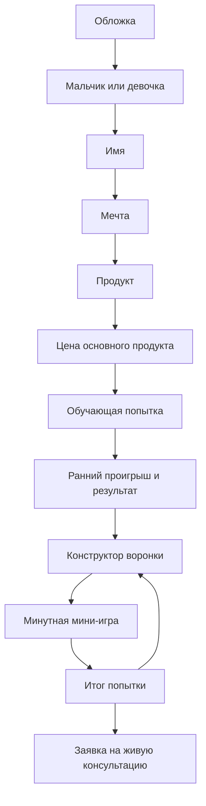

# ТЗ v4: «Собери воронку на мечту»

## Статус и цель

Этот документ — источник правды для новой версии игры. Он заменяет v3 как продуктовый поток. V3 сохраняется только как источник проверенных формул, seeded-расчета, action log и доставки заявки на живой разбор.

Цель игрока — не прожить историю и не оптимизировать таблицу конверсий. Он перебирает варианты воронки, чтобы заработать на выбранную мечту, видит последствия своих решений и либо хочет повторить успешную связку в реальности, либо оставляет заявку на живую консультацию.

Принципы:

- mobile-first, один последовательный экран за раз;
- без истории, ниши, суперсил, игровых дней, отдыха, советов и прошлых попыток;
- один запуск в мини-игре представляет две недели работы;
- расчеты, конверсии, бюджет, энергия и результаты принадлежат `packages/game-engine`;
- UI не содержит коэффициентов и не использует `Math.random()`;
- сервер хранит каноническое состояние, команды идемпотентны;
- все игровые изображения и анимации оригинальные pixel-art assets.

## Короткий путь игрока



После первой попытки игрок может сколько угодно раз менять продукт, цену и воронку. Пол, имя и мечта остаются прежними на всю сессию: варианты должны сравниваться с одной и той же целью.

## Стартовые экраны

### 1. Обложка

Текст: «Проверь, какая воронка поможет заработать на твою мечту». CTA: `Начать`.

### 2. Персонаж

Только два шага:

1. выбор `мальчик` или `девочка` — влияет на аватар и обращение;
2. имя, 2–30 символов.

Ниши, персонажная история и суперсилы отсутствуют.

### 3. Мечта

Используется существующий набор карточек мечт с суммами и вариант `Своя мечта` (название и стоимость). Для одной сессии выбирается ровно одна мечта.

### 4. Продукт и цена

Игрок выбирает тип основного продукта из существующего списка и вводит цену. Основной продукт всегда продается по этой цене в финальном продажном этапе.

## Деньги, победа и энергия

### Бюджет запуска

- Каждая попытка начинается заново со `100 000 ₽`.
- Расходы на специалистов и рекламу определяются выбранными вариантами инструмента и конфигом.
- Рилсы и сторис могут быть сделаны самостоятельно или куплены у специалиста: специалист стоит денег и повышает эффективность.
- Внешняя реклама расходует бюджет автоматически по ходу мини-игры.
- До старта показываются известные расходы: `Заложили на запуск` с разбивкой по инструментам и `Осталось в банке`.
- Если заложено больше бюджета, это предупреждение, а не блокировка: игрок может проверить провальную гипотезу.
- Во время игры виден оставшийся банк. При нуле бюджета попытка немедленно заканчивается.

### Доход

- Доход от основного продукта: количество его продаж × введенная цена.
- Доход от трипваеров: количество продаж конкретного этапа × цена, введенная для него.
- Итоговые деньги = остаток стартового банка + вся выручка за попытку.

### Победные состояния

| Результат | Условие | Сообщение |
| --- | --- | --- |
| Не достиг цели | Итоговые деньги меньше стоимости мечты | «На мечту пока не заработали» |
| Мечта куплена, но запуск не восстановлен | Итоговых денег хватает на мечту, но после ее покупки меньше 100 000 ₽ | «Мечту купить можно, но денег на новый запуск не осталось» |
| Устойчивый выигрыш | После покупки мечты остается не меньше 100 000 ₽ | «Вы купили мечту и вернули бюджет на следующий запуск» |

### Энергия

- Каждая попытка начинает со `100` энергии.
- Энергия не тратится при сборке воронки и не восстанавливается отдыхом: экрана отдыха нет.
- Она тратится только на ручные действия в мини-игре: ответы в сообщениях, ручные продажи и созвоны.
- Автоматические этапы, например ИИ-бот или сайт, энергию не тратят.
- При `0` энергии попытка завершается выгоранием.

## Обучающая попытка

После ввода мечты, продукта и цены игрок не строит первую воронку сам. Игра проводит его через фиксированную плохую связку:

```text
Внешняя реклама → Telegram-канал → Созвоны
```

Это та же минутная игра, но конфиг намеренно ведет к завершению за 15–20 секунд:

- дорогая внешняя реклама быстро расходует банк;
- ручной Telegram-прогрев и созвоны быстро расходуют энергию;
- игрок делает примерно 1–2 продажи, но видит масштаб потерь.

После результата открывается конструктор собственной воронки. Учебный сценарий объясняет механику действиями, а не длинной инструкцией.

## Конструктор воронки

### Базовые правила

- Воронка содержит от 2 до 6 этапов.
- Игрок выбирает число этапов, добавляет, удаляет и переставляет их до запуска.
- Один и тот же инструмент разрешено использовать несколько раз. Каждый экземпляр — самостоятельный этап со своими настройками и расходами.
- Первый этап обязан быть рекламным. Если выбран другой инструмент, показывается блокирующее пояснение: `А как люди узнают, что ты это делаешь? Первый шаг — всегда реклама.`
- После первого этапа порядок не блокируется. Игрок вправе собрать нелогичную последовательность; движок обязан промоделировать ее и отразить ошибку в результате как «сломанная воронка».
- До запуска не показываются проценты конверсии, прогноз выручки или «лучшая» связка.

### Полный список инструментов

Сохраняется весь текущий набор:

| Реклама | Прогрев / ценность | Продажа |
| --- | --- | --- |
| Сторис | Гайд / лендинг | Переписка |
| Рилс | Обычный бот | Созвон |
| Telegram-канал | ИИ-бот | Сайт |
| Внешняя реклама | Урок | |
| | Автовебинар | |

Старые категории не должны ограничивать позицию инструмента. Каждый инструмент описывается в конфиге через допустимые входы, выходы, автоматизацию, расходы, ручные события и конверсии. Это позволяет, например, использовать ИИ-бота как бесплатный лид-магнит или как часть продажи.

### Настройка каждого этапа

После выбора инструмента показываются только релевантные вопросы:

1. `Самостоятельно` или `Со специалистом` — если у инструмента есть оба варианта. Вариант специалиста дороже и имеет собственную конверсию.
2. Для промежуточного ценностного этапа: `Бесплатно` или `Назначить цену`.
3. При `Назначить цену` игрок вводит цену трипваера. Она относится только к этому экземпляру этапа.

Рекламные инструменты не имеют цены для клиента: у них есть собственные расходы. Финальные продажи через переписку, созвон или сайт продают основной продукт по цене, заданной в начале, а не создают еще одну цену продукта.

## Логика воронки и конверсий

### Модель

Движок хранит каждую воронку как упорядоченный массив экземпляров этапов. У экземпляра есть:

- инструмент;
- способ исполнения: самостоятельно / специалист;
- режим предложения: бесплатно / трипваер;
- цена трипваера, если она есть;
- расходы на запуск и/или расход бюджета;
- входной и выходной статус аудитории;
- ручные действия и их стоимость энергии;
- конверсия, зависящая от позиции, режима, цены основного продукта и предшествующего состояния аудитории.

Расчеты должны быть seeded и воспроизводимыми. Повтор одного и того же сценария с той же seed дает один и тот же результат; новая попытка получает новую серверную seed.

### Ошибки воронки

Единственное жесткое правило — рекламный первый этап. Остальные несовместимости не блокируются, а становятся диагностируемыми ошибками. Примеры:

- этап не получает подходящую аудиторию от предыдущего;
- люди отправлены на продажу без прогрева, нужного этому продукту;
- ручных действий больше, чем хватает энергии за минуту;
- бюджет закончился до того, как воронка дошла до продаж;
- один и тот же поток отправлен в несовместимый следующий этап.

Отчет указывает на ошибку и ее потери, но не строит за игрока идеальную воронку и не дает готовый рецепт.

### Баланс

Текущие коэффициенты v3, где они относятся к тем же инструментам, используются как стартовая база. Перед релизом обязательно обновить конфиг и прогнать симулятор.

Целевое требование баланса: для типичных цен и мечт должно существовать 2–3 жизнеспособных сценария воронок. Их можно найти маркетинговым пониманием или несколькими попытками, но победа не должна быть случайной либо слишком легкой.

## Мини-игра: 60 секунд = 2 недели запуска

### Общие правила

- Каждая попытка длится максимум 60 секунд реального времени и представляет две недели запуска.
- Она может завершиться раньше при нуле бюджета или энергии.
- На экране нет числовых конверсий и нет ручного выбора исхода продажи.
- Игрок нажимает только на ручные действия. Успехи, отказы и остывание происходят автоматически по расчету движка.

### Компоновка

```text
┌──────────────────────────────────┐
│ 00:43       Банк 52 000   ⚡ 68    │
├──────────────────────────────────┤
│ Рекламная лента: карточки → → →   │
├──────────────────────────────────┤
│ [иконка этапа 1]                  │
│          ↓ персонажи              │
│ [иконка этапа 2]                  │
│          ↓                        │
│ [иконка этапа 3]                  │
│          ↓                        │
│ [иконка этапа 4]                  │
├──────────────────────────────────┤
│ [Ответь в директе]                │
└──────────────────────────────────┘
```

Верхняя рекламная лента движется слева направо: карточки рилсов, сторис, Telegram или внешней рекламы появляются в соответствии с выбранным первым этапом. Из нее появляются маленькие персонажи-заявки, которые двигаются вниз через квадратные иконки этапов выбранной воронки.

### Состояния персонажа

- оранжевый — теплый, ждет ручного действия;
- синий — остыл и уходит за пределы экрана;
- зеленый на продажном этапе — купил;
- красный на продажном этапе — не купил.

Автоматический этап сразу перемещает человека дальше. На ручном этапе персонаж ожидает действия игрока. Ушедшие и купившие персонажи всегда получают короткую, понятную анимацию; успешная продажа — вспышку и монеты.

### Ручные действия

На экране всегда не больше одной основной актуальной кнопки. Текст зависит от источника и этапа:

- рилс или сторис → `Ответь в директе`;
- внешняя реклама или Telegram → `Ответь в личке`;
- созвон → `Проведи созвон`;
- ручная продажа в переписке → `Продай в переписке`.

У каждого ручного действия задана длительность блокировки и расход энергии в конфиге. Пока игрок занят созвоном, новые теплые заявки продолжают ждать и могут остыть.

## Итог попытки

Главный экран результата должен быть коротким, блоковым и без конверсий.

Обязательные блоки:

1. вердикт: цель не достигнута / мечта куплена / устойчивый выигрыш;
2. `Потратили` — сумма и разбивка, на что ушли деньги;
3. `Заработали` — раздельно основной продукт и трипваеры;
4. `Потеряли` — потенциальные деньги, сгруппированные по конкретным ошибкам;
5. `Итог в банке` и сумма, остающаяся после покупки мечты;
6. 1–3 наблюдаемые ошибки: например, «бюджет закончился до продаж», «заявки остыли во время созвонов», «этап не получил подходящий поток людей».

Потенциальные потери считает движок по уникальным потерянным людям и их достижимой последующей ценности. Одна и та же заявка не должна учитываться в потерях дважды.

Дополнительная кнопка `Посмотреть детали расчета` открывает отдельный экран/модалку с конверсиями и математикой для заинтересованного игрока. Это не часть главного результата.

### CTA

| Состояние | Основные действия |
| --- | --- |
| Мечта не достигнута | `Сыграть еще раз`, `Хочу на живую консультацию` |
| Мечта достигнута | `Хочу такую воронку себе`, `Сыграть еще раз` |

Обе консультационные CTA открывают существующую форму заявки на живой разбор. Заявка считается отправленной только после серверного сохранения и успешной доставки через уже существующий адаптер Telegram/webhook.

## Что удаляется из v3 UX

- сюжет, партнер/партнерша и создание ниши;
- суперсилы;
- HUD дней и игровая длительность 30 дней;
- меню рефлексии, подготовка, отдых, советы и история попыток;
- отдельные дни, стоимость времени подготовки и энергия за подготовку;
- обязательное деление выбора на одну рекламу, один прогрев и одну продажу;
- показ конверсий до завершения попытки.

## Данные и команды

Новый state минимально хранит:

- игрока: пол и имя;
- мечту и ее стоимость;
- выбранный основной продукт и его цену;
- текущую/последнюю воронку из 2–6 этапов;
- seed, остаток бюджета, энергию, журнал ручных действий и состояние активной попытки;
- итоговый отчет и известную детальную математику попытки;
- флаг завершения учебной попытки;
- данные существующей формы лида не включаются в игровой расчет.

Предпочтительные команды:

- `startV4Session`, `setGender`, `setName`, `selectDream`, `selectProduct`, `setProductPrice`;
- `startTutorialAttempt`, `finishTutorialAttempt`;
- `setFunnelLength`, `addFunnelStage`, `removeFunnelStage`, `moveFunnelStage`, `configureFunnelStage`;
- `startFunnelAttempt`, `applyFunnelAction`, `finishFunnelAttempt`;
- `startNextAttempt`.

Все команды изменения состояния должны использовать текущую оптимистичную версию и idempotency key.

## Приоритет реализации

1. Добавить v4 state/types/config и миграционный слой, не ломая сохраненные v3-сессии.
2. Перенести/адаптировать в движок детерминированный расчет этапов, бюджета, энергии, потерь и трипваеров.
3. Написать fixtures, unit-тесты инвариантов и balance simulator для 2–6 этапов и повторных инструментов.
4. Реализовать новый setup и обучающую попытку.
5. Реализовать конструктор воронки и прозрачные расходы.
6. Реализовать минутную мини-игру с вертикальной воронкой и анимациями.
7. Реализовать результат, детали расчета и существующий лидовый CTA.
8. Прогнать `pnpm validate:config`, `pnpm simulate:balance -- --runs 50000`, lint, typecheck, unit/e2e и build.

## Definition of Done

- Игрок проходит только пол/имя, мечту, продукт и цену перед учебной попыткой.
- Учебная связка завершается ранним понятным проигрышем.
- Своя воронка содержит от 2 до 6 этапов и допускает повторы инструментов.
- Только рекламный первый этап блокируется; остальные ошибки диагностируются результатом.
- Бюджет и энергия могут закончить попытку раньше 60 секунд.
- Расходы, выручка, потенциальные потери и устойчивость выигрыша считаются движком.
- Мини-игра показывает движение рекламы и людей через иконки этапов без конверсионных цифр.
- Главный результат не раскрывает готовую воронку и не перегружен математикой.
- Консультационная CTA использует реальную проверенную доставку заявки.
- Новые баланс, unit и e2e проверки проходят; в балансовом отчете нет нарушений инвариантов.
